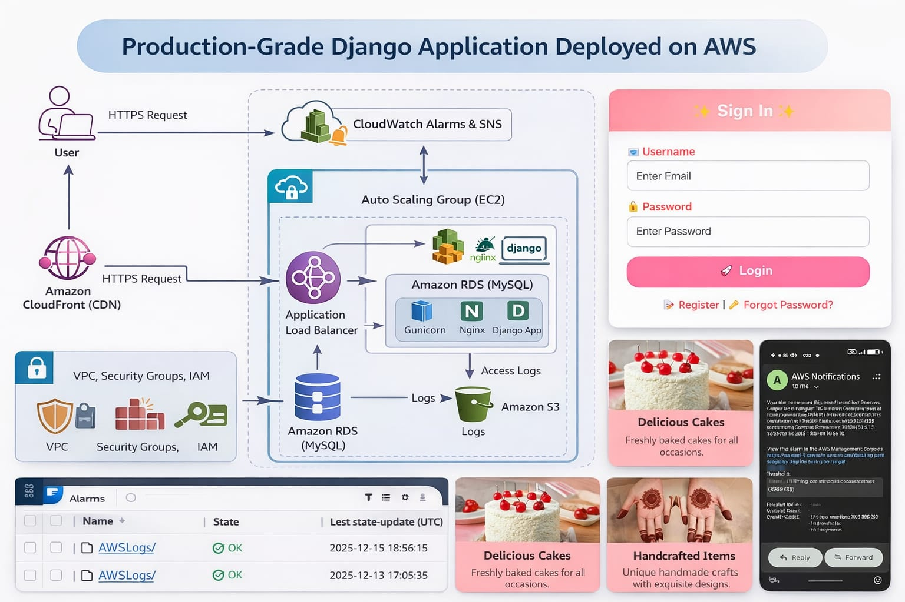
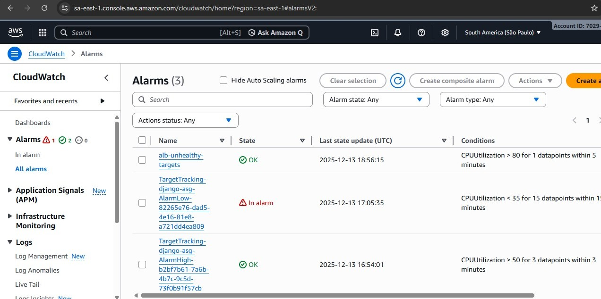
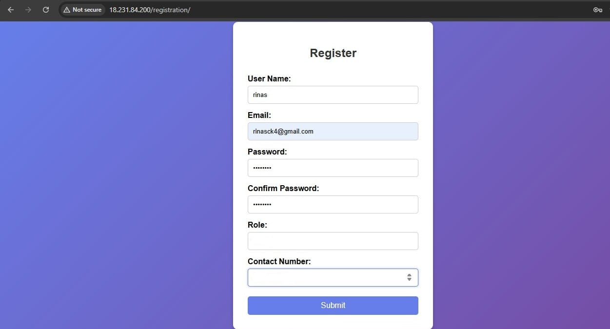
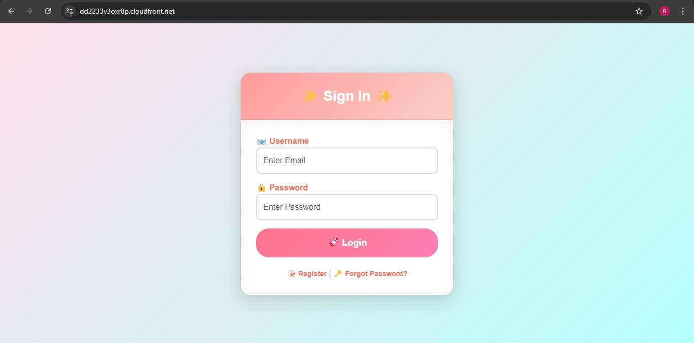
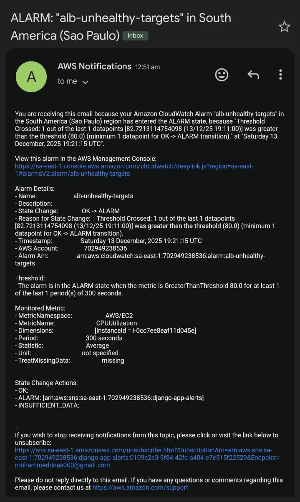
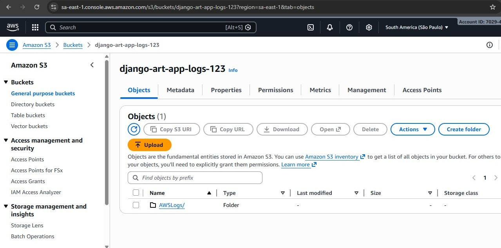

# 🚀 Production-Grade Django Application on AWS


A production-ready Django web application deployed on AWS using modern DevOps and cloud best practices.

This project demonstrates scalable architecture, monitoring, security, and real-world deployment.

---

## 📌 Project Overview

This project focuses on building and deploying a highly available Django application on AWS with:

- Load balancing
- Auto scaling
- Centralized logging
- Monitoring & alerts
- Secure networking
- CDN acceleration

It simulates real-world production infrastructure used in enterprise environments.

---

## 🛠 Tech Stack

### Application Stack
- Django (Python Framework)
- HTML / CSS / Bootstrap
- Gunicorn (WSGI Server)
- Nginx (Reverse Proxy)

### AWS Services
- Amazon EC2
- Application Load Balancer (ALB)
- Auto Scaling Group (ASG)
- Amazon RDS (MySQL)
- Amazon S3
- Amazon CloudFront (CDN)
- Amazon CloudWatch
- Amazon SNS
- VPC
- IAM
- Security Groups

---

## 🏗 Architecture Overview

### Request Flow

User  
→ CloudFront (CDN)  
→ Application Load Balancer (ALB)  
→ Auto Scaling Group (EC2 Instances)  
→ Nginx  
→ Gunicorn  
→ Django Application  
→ Amazon RDS (MySQL)

### Logs & Monitoring Flow

Application Logs  
→ CloudWatch  
→ SNS Alerts  
→ Amazon S3 (Storage)

---

## ✨ Key Features

✅ Production-ready Django deployment  
✅ High availability using ALB + ASG  
✅ Secure networking with VPC  
✅ Managed database using RDS  
✅ CDN acceleration via CloudFront  
✅ Monitoring & alerts with CloudWatch + SNS  
✅ Centralized logging in S3  
✅ Session & security management  
✅ Scalable cloud infrastructure  

---

## ⚙ Deployment Workflow

### 1️⃣ Infrastructure Setup
- Created VPC with public/private subnets
- Configured route tables and internet gateway
- Set up security groups for ALB, EC2, and RDS
- Created IAM roles for EC2 access

### 2️⃣ Server Configuration
- Installed Python, Nginx, and Gunicorn
- Configured Nginx as reverse proxy
- Deployed Django application
- Connected app with RDS

### 3️⃣ Load Balancing & Scaling
- Configured Application Load Balancer
- Created Auto Scaling Group
- Enabled health checks
- Configured launch templates

### 4️⃣ Monitoring & Alerts
- Enabled CloudWatch metrics
- Created alarms for CPU and health
- Configured SNS email notifications

### 5️⃣ CDN & Storage
- Integrated CloudFront
- Configured S3 for static files and logs
- Enabled caching policies

---

## 💻 Local Development Setup

### Prerequisites
- Python 3.x
- MySQL
- Git
- AWS Account

### Installation (Local)

```bash
git clone https://github.com/your-username/your-repo-name.git
cd your-repo-name

python3 -m venv env
source env/bin/activate

pip install -r requirements.txt

python manage.py migrate
python manage.py runserver
```

### Open in Browser

```
http://127.0.0.1:8000
```

---

## 🔐 Security Implementation

- VPC network isolation
- Private RDS instance
- IAM role-based access
- Security group restrictions
- CSRF protection
- Secure cookies
- Reverse proxy protection
- HTTPS via CloudFront

---

## 📊 Monitoring & Logging

- CPU & memory monitoring via CloudWatch
- ALB health checks
- Auto scaling based on load
- SNS email alerts
- Centralized logs in S3
- Access log analysis

---

## 📸 Screenshots

Screenshots of the application, monitoring dashboards, and alerts are available in the `/screenshots` folder.
---

### Architecture Diagram


### CloudWatch Monitoring


### Registrartion Page


### Login Page 


### Application Page


### Alert Notifications


### S3 Logs


---


---

## 🚀 Future Enhancements

- Terraform automation
- CI/CD with GitHub Actions
- Containerization using Docker
- Kubernetes deployment
- WAF integration

---

## 👨‍💻 Author

**Mohammed Rinas CK**

📌 Cloud & DevOps Engineer  
📌 Actively seeking opportunities

LinkedIn: https://linkedin.com/in/rinas-ck
GitHub: https://github.com/rinas-ck  

---

## ⭐ Support

If you like this project, please give it a ⭐ on GitHub!
